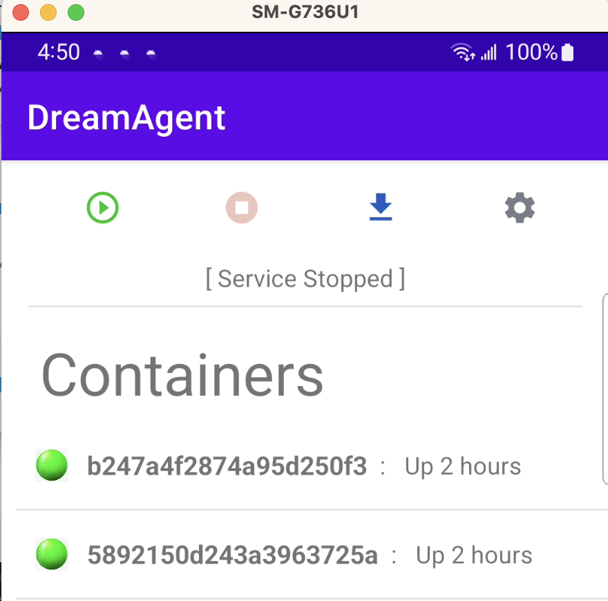
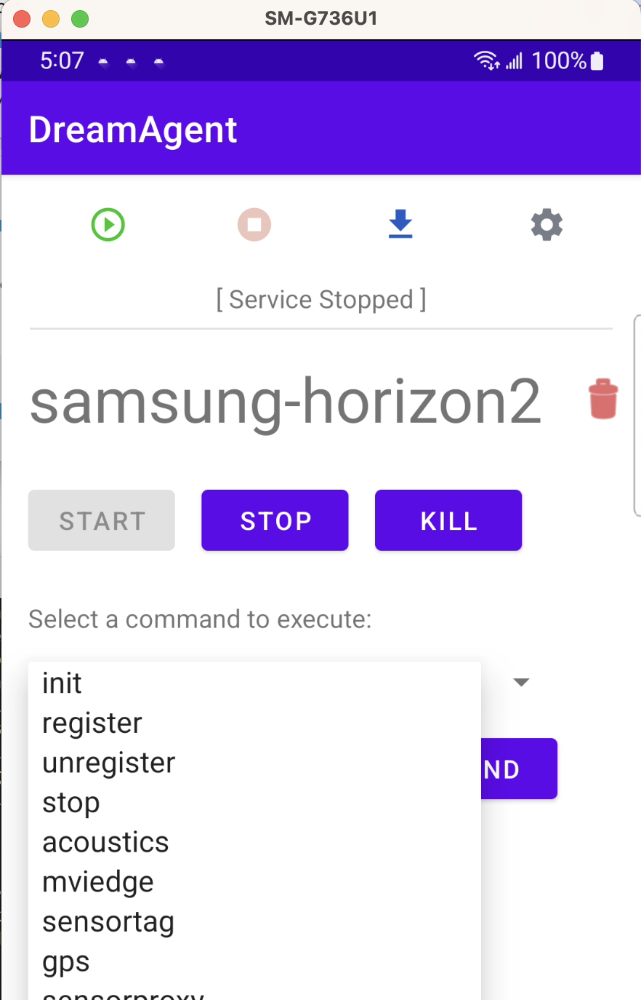

# Anax NodeJS toolkit for application deployment and workload placement on Android devices 

The goal is to simplify and to reduce the amount of manual steps in creating and updating configurations and other system files.  

We have created templates in /templates directories to help automate the deployment process by extracting all the hardcoded values and needed envirnoment variables into this /hzn-config/.env-local.json file which should not be checked into Github.  If for some reason /hzn-config/.env-local.json did not get created, you can create copying env-template.json and fill in the appropriate values.  

These ```templates/anax.json, templates/horizon, templates/hzn.json, dockerfile-template``` files use tokenized placeholders and are to be used to generate needed configuration files at run-time.  The output files for each environment are placed in ```dist ``` folder 

With .env-local.json in place, we now can manage as many environments as needed by providing the needed values in .env-local.json.  Please see env-template.json for example.

# Install oh-android
```
npm install -g oh-android
```

# Available commands
```
action  Available actions: adbPush adbPushDreamAgent buildImage ibmLogin
        makeAll makeAnaxJson makeDeploy makeDirectories makeDockerFile
        makeDreamAgentYaml makeHorizon makeNodePolicy makeSystemFiles
        pushImage  
```  

# Examples
```
oha deploy -h
oha deploy ibmLogin   
oha deploy makeAll --org=samsung
oha deploy makeDeploy --org=samsung  
// Note: creates neccessary files to start agent container without build/push docker image
```

# Notes
Typically, the following command is usually what you need to run to generate the config files and push application.yaml to the phone if all the needed values are provided in /hzn-config/.env-local.json file for a particular device.

```
oha deploy makeDeploy --org=samsung-R3CT307YNNW
```

```
--org=<the-key-of-the-json-object> as shown below

  "samsung-device-name": {
    "CONTAINER_NAME": "samsung-horizon2",
    "ARCH": "arm64",
    "REGISTRY": "us.icr.io",
    "NAME_SPACE": "ieam-samsung-colab",
    "IAMUSER": "iamapikey",
    "IAMAPIKEY": "",
    "SERVICE_NAME": "ieam-samsung",
    "ANAX_VERSION": "v2.30.0-1194",
    "HORIZON_AGENT": "horizon-agent-linux-deb-arm64.tar.gz",
    "REDHAT_VERSION": "9.1",
    "LABEL_STAGE": "stage=builder",
    "LABEL_VENDOR": "IBM",
    "LABEL_SUMMARY": "The agent in a general purpose container.",
    "LABEL_DESCRIPTION": "A container which holds the edge node agent, to be used in environments where there is no operating system package that can install the agent natively.",
    "HZN_EXCHANGE_URL": "https://cp-console.ieam42-edge-8e873dd4c685acf6fd2f13f4cdfb05bb-0000.us-south.containers.appdomain.cloud/edge-exchange/v1",
    "HZN_FSS_CSSURL": "https://cp-console.ieam42-edge-8e873dd4c685acf6fd2f13f4cdfb05bb-0000.us-south.containers.appdomain.cloud/edge-exchange/edge-css/",
    "HZN_ORG_ID": "samsung",
    "HZN_DEVICE_ID": "samsung-device-name",
    "HZN_EXCHANGE_USER_AUTH": "",
    "HZN_MGMT_HUB_CERT_PATH": "/etc/horizon/agent-install.crt",
    "HZN_AGENT_PORT": "8510",
    "HZN_AGBOT_URL": "https://cp-console.ieam42-edge-8e873dd4c685acf6fd2f13f4cdfb05bb-0000.us-south.containers.appdomain.cloud/edge-exchange/edge-agbot/",
    "HZN_SDO_SVC_URL": "https://cp-console.ieam42-edge-8e873dd4c685acf6fd2f13f4cdfb05bb-0000.us-south.containers.appdomain.cloud/edge-exchange/edge-sdo-ocs/api",
    "HZN_NODE_POLICY": "/etc/default/node.policy.json",
    "HZN_VAR_RUN_BASE": "/data/var/tmp/horizon",
    "PROVIDE_CERT": "/Users/jeff/sandbox/samsung/credential/agent-install-samsung.crt",
    "NODE_POLICY": {
      "properties": [
        {
          "name": "openhorizon.allowPrivileged",
          "value": true
        }
      ],	    
      "deployment": {
        "properties": [
          {"name": "auto-dock", "value": "Auto Dock"}
        ]
      }
    }
  }

```

After the command completed:
- go to the DreamAgent on your phone and press the blue down arrow icon to start the container.



- Then select horizon container and select init from the dropdown and click SEND to generate the node policy 
- Then select register to register this device with the generated node policy



- The containerized applications/services should be up and running once the agreement is reached and deployment is complete.
- Docker ps or from DreamAgent UI should show the apps that are running

# Screen recording of Samsung Demo web app to showcase different use cases
<video src="geofencing.mp4" controls="controls" style="max-width: 730px;">
</video>